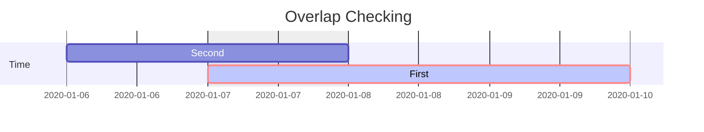
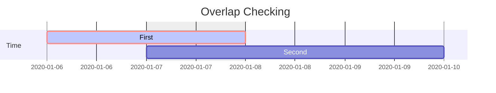
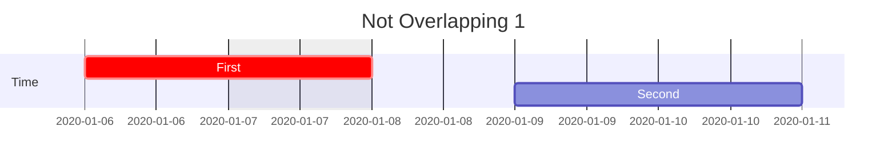
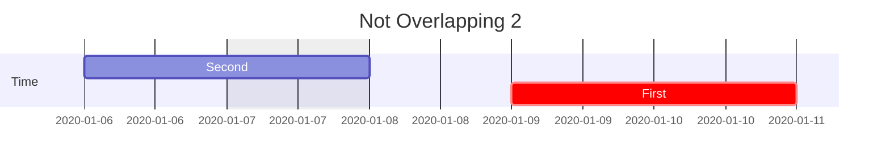

A long time ago I wanted to check if two timespans are overlapping each other. The question looks actually simple but, It gets tricky in implementation, specially when you are checking conditions against database value you need to find an optimized solution. one Intuitive approach is to find out if the first timespan start is within the second timespan or again first timespan end is within second one's boundaries.

## The first timespan start is within the second timespan


## The first timespan end is within the second timespan

## The not overlapping situation

To find main problem answer, the simplest way would find the scenarios which two timespans are not overlapped:



And the complement would be the answer:
```python
! (first.start>second.end or second.start>first.end)
```

Whis is equavelt to:
```python
first.start<second.end and second.start<first.end
```
Thats it.
<!-- Parallel 1   :         des3, after des1, 1d
Parallel 2   :         des4, after des1, 1d
Parallel 3   :         des5, after des3, 1d
Parallel 4   :         des6, after des4, 1d -->


