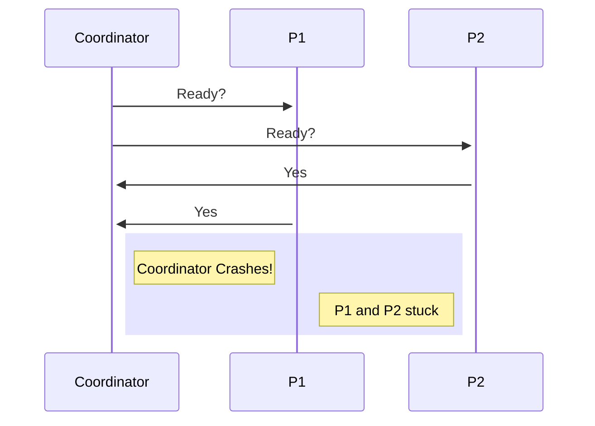

## Distributed Commitment

To commit some action on distributed nodes, we need to harmonize the commitment between nodes, that way we are sure that the all nodes together go to commit state and all do the action. In other words commitment should occur if and only if all nodes commit the action. If one of nodes failed to commit the other nodes should abort and never commit.

## Two Phase Commitment
An intuitive approach whould be to have a coordinator which coordinates decision making between nodes. 

## First Step
Coordinator AKA leader asks all nodes if they are ready to commitment or not. Each node checks whether available resources allow it to commit or not and if it can reserves resources answers `"Yes"` to the first request receiving from coordinator.

## Second Step
Coordinator as centeralized decision maker, checks all nodes' answers whether they all can commit or not. 
If all can commit, the coordinator asks all of the nodes to commit.
If atleast one of nodes said `"No"` to first step, the coordinator decides to `"Abort"` and send abort command to all nodes which causes rollback in nodes.

## Problem
Sometimes coordinator crashes before making any decision, And you can guess that the nodes which reserved resources and answered `"Yes"` are stuck. we can't use timeout because we have no upperbound in this asynchronous(different message speeds) network and if one node sooner than others goes to rollback would release resources that will cause `inconsistency`.

-if a node answers `"No"`, it can `"abort"` and rollback itself because it knows what would be desicision which whould be `"abort"`.

<!-- - Liveleness and Fairness -->